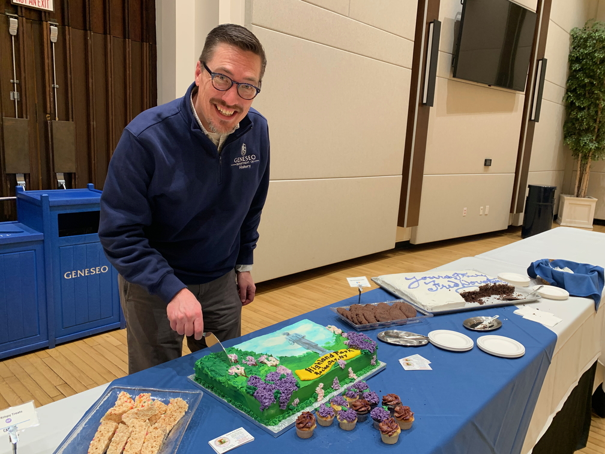
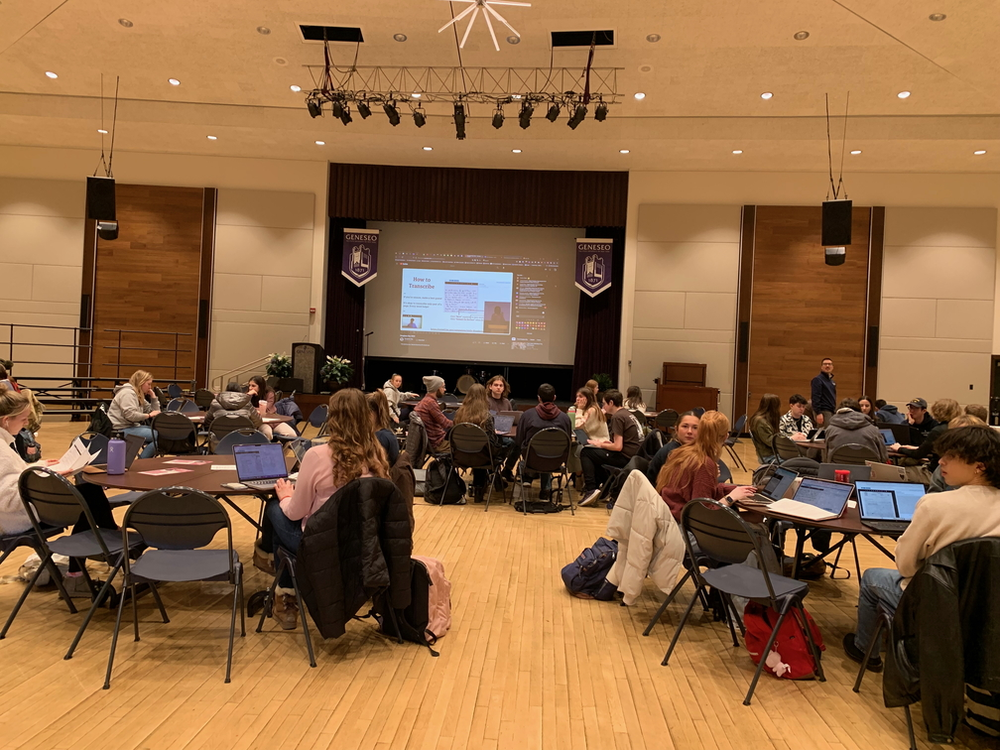

{: .alt-warning}
You're viewing an archived page from Douglass Day 2024.

# Photos and Video from Douglass Day 2024

## Morning: Geneseo Chamber Singers: Eyes on the Prize
<iframe width="560" height="315" src="https://www.youtube.com/embed/iQutmhLKZH8?si=I5tZdnxDl3SGdPvn" title="YouTube video player" frameborder="0" allow="accelerometer; autoplay; clipboard-write; encrypted-media; gyroscope; picture-in-picture; web-share" referrerpolicy="strict-origin-when-cross-origin" allowfullscreen></iframe>  
*The Geneseo Chamber Singers perform "Eyes on the Prize," conducted by Distinguished Service Professor of Music Gerry Floriano.*

  
*Group portrait of the Geneseo Chamber Singers with Maestro Floriano and Wade Anthony Norwood, of the Rochester gospel group Wayne Anthony Norwood and the Children of God.*

## Afternoon: Live stream, transcription, cake

  
*Students transcribe documents from the Library of Congress collection of Douglass correspondence during the live stream*

  
*Douglass Day Cake and cupcakes generously donated by [Sweet Arts Bakery](https://sweetartsny.weebly.com/), Main Street, Geneseo.*

  
*The Sweet Arts cake is decorated with the Frederick Douglass statue in Highland Park, Rochester.*

  
*Professor of History Justin Behrend cuts the cake.*

  
*Douglass Day cake generously donated by Campus Auxiliary Services at Geneseo. One of two.*

  
*The second cake from Campus Auxiliary Services.*

<!-- 

 -->

