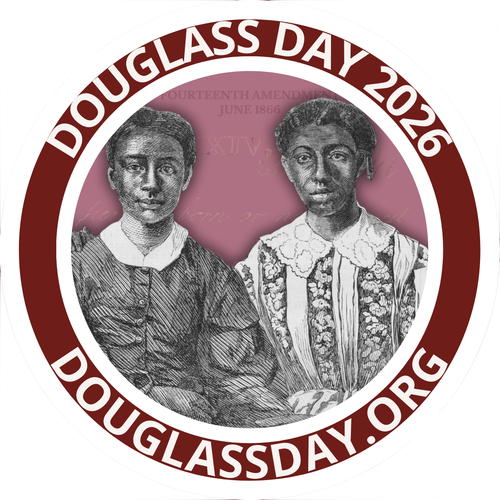

# How Do I Transcribe?

Every Douglass Day, participants, wherever they are, work together to transcribe historical documents that help tell the story of Black activism in the United States. The 2026 transcribe-a-thon returns to the [Colored Conventions Project](https://coloredconventions.org), "an interdisciplinary research hub that uses digital tools to bring the buried history of nineteenth-century Black organizing to life." Geneseo participants will transcribe digitized historical documents from the nineteenth-century state and local political meetings, known at the time as "Colored Conventions," where African Americans from the United States and Canada gathered to organize their struggle for civil and human rights.

What were the Colored Conventions? We've reprinted the Douglass Day organizers' [useful explainer here]({{ site.url }}/colored-conventions) so you can quickly get up to speed. But the even shorter version, as explained by the organizers,  is this: "The Colored Conventions were state and national meetings held by free and formerly enslaved African Americans to debate their collective struggles. We estimate that more than 10,000 delegates attended more than 600 Colored Conventions. At these meetings, delegates talked about voting rights, education, labor, business, and a whole lot more. The conventions were highly democratic spaces at a time when Black people were denied access to the voting booth or the jury box."

Transcribers will use the [Zooniverse](https://zooniverse.org) crowdsourcing platform for this year's work.

## How to Transcribe

{: .alt-warning}
You can download and print a <a href="https://drive.google.com/file/d/13BrxTC7Y-H2pUWlZlvrP0b2XTibSEnh5/view?usp=sharing" style="color: black; text-decoration: underline;">pdf version of these instructions.</a>

### Do​     ​      ​      ​          ​          ​      ​        ​       
- Type every word on the page into the text box​             ​       
- Insert a new (blank) line between paragraphs​
- ​Keep original spelling, grammar, capitals​​
- Include all titles and page numbers

### Don't

- Don't expand abbreviations ​
- Don't worry about formatting​
- Don’t worry about line-breaks

​Find something interesting? Share it on Instagram or Bluesky using #DouglassDay!

### How To Find the Names

1. Type all of the names in a list
2. Add each name once
3. Separate each name using a semicolon (`;`);
4. Match the exact spelling, abbreviations, and capitals
5. Type any titles (Rev., Dr., Mrs., etc)
6. Add \[square brackets\] if you see clues that any of the names are women

Example: Frederick Douglass; Wm. W. Brown; Rev. H. M. Turner; \[Mary Ann Shadd\]​

### Tips for the Zooniverse Site

| Topic | Tip |
------- | -----
| ⚠️ Warning | There is no auto-save or save function! |
| See the Full Page | Scroll down to see the full page. |
| Get a New Page | Want a new page? Just refresh your browser. |
| Need Help? | Click the TUTORIAL button for step-by-step guidance. |
Leave Comments | Click in the bottom right corner to comment on the page. |
Resize Text Box | Drag the lower right corner to expand the text box. |

### Project FAQ

**Do I need an account?**  
No, but we really recommend it! An account lets you track your progress and see your past work.

**What is a "subject set"?​**  
A subject set is a group of digitized files or records. We have grouped records by state/area.

**Is there auto-save?​**  
No. There is no save feature on Zooniverse. If you are working on a long page, consider typing in a separate document first, then copy and paste the text into the text box.

**Scroll up and down the page​**  
Make sure you scroll down to see the whole page. Some pages may be longer than your screen.

### Formatting Rules

**How do I add a blank line between paragraphs?**  
Insert one empty line between paragraphs. In practical terms, the Return button twice.

**What about words split across lines?**  
Do not keep the hyphen for words split across lines.

**How do I mark women's names?​**  
Add [square brackets] if you see clues that any of the names are women.

**What if I see women mentioned, but there are no names?**  
If you’re not sure, you can leave a short comment. If you see a reference to women, but no names, you can type those words in the last step.

**What if the text has been changed or is hard to read?​**  
Highlight the text and then click on one of these buttons:

- Deletion: words that were crossed out or typed over
- Insertion: words that were added to the original text
- Unclear: words that are difficult to read

### Tips for Success

**What is TALK?**  
Talk is our project forum.

**What if I make a mistake?**  
Our team reviews everything.

**Should I take breaks?​**  
Take a break every 15 mins

{: .alt-warning}
These videos reference the URL for accessing Colored Conventions documents in 2022. The Zooniverse user interface has changed a bit from what you'll see here, but the instructions are still helpful.

<iframe width="560" height="315" src="https://www.youtube.com/embed/-D3O4tCFTAk?si=aNhyo2urREnON35p" title="YouTube video player" frameborder="0" allow="accelerometer; autoplay; clipboard-write; encrypted-media; gyroscope; picture-in-picture; web-share" referrerpolicy="strict-origin-when-cross-origin" allowfullscreen></iframe>

<iframe width="560" height="315" src="https://www.youtube.com/embed/MHwEN0XNcQk?si=BMNmRA8En5De1QDw" title="YouTube video player" frameborder="0" allow="accelerometer; autoplay; clipboard-write; encrypted-media; gyroscope; picture-in-picture; web-share" referrerpolicy="strict-origin-when-cross-origin" allowfullscreen></iframe>

<iframe width="560" height="315" src="https://www.youtube.com/embed/5Gt0NHi9wrU?si=VSNfuSOWPSNF_9z9" title="YouTube video player" frameborder="0" allow="accelerometer; autoplay; clipboard-write; encrypted-media; gyroscope; picture-in-picture; web-share" referrerpolicy="strict-origin-when-cross-origin" allowfullscreen></iframe>

<iframe width="560" height="315" src="https://www.youtube.com/embed/TYsi932vw3o?si=mjg0VtQQhLUCBzaU" title="YouTube video player" frameborder="0" allow="accelerometer; autoplay; clipboard-write; encrypted-media; gyroscope; picture-in-picture; web-share" referrerpolicy="strict-origin-when-cross-origin" allowfullscreen></iframe>

<!-- # Transcription FAQ

{: .alt-warning}
The FAQ below is reproduced from the Douglass Day project page in Zooniverse.

## I'm just here to transcribe, what's with these other questions?

We want you to transcribe too! You will likely encounter a few questions before the transcription so that we can help you provide the transcription that will be most valuable to us.

## What if I transcribe something wrong?

That's okay! We are most interested in what you see on the page. Other users will also be transcribing the same documents that you are, so we will be able to compare and contrast different attempts at transcriptions to come up with the most accurate results possible. There are also buttons you can use during the transcription to indicate if a section of text is unclear.

## What is a workflow?

A workflow is the category of documents that you can choose from on the home page. One example is "Transcribe:" If you'd like to know what documents you might find in each workflow, check out the Field Guide section entitled "Workflow Descriptions."

## There are a lot of workflows, where should I start?

Start wherever you would like! If any documents have been transcribed enough they will disappear from the home page, meaning that whatever you see is something that we definitely need transcribed. The majority of our other documents only have words. A small percent of the documents in any of the workflows may be blank or contain only images and you will see instructions on what to do with those within the workflow tasks or the tutorial. Each workflow shows a different aspect of the Conventions' history, so choose whichever one(s) that interest you the most.

If you want a little more spontaneity, you can also click 'Classify' at the top of the page, and Zooniverse will choose a random workflow for you.

## How do I locate women in the sources?

Compared to transcribing, this is much simpler! To locate the people who identified as women, read the entire document. Then simply enter in the name of any women who appear in the document. This way, we can build a fuller and more complex understanding of their role at the Colored Conventions.

## For some reason, my transcription isn't formatted like the document. What should I do about this?

Yes, we understand that you may want to keep the document's original format, but we are primarily concerned with your word by word transcription. Please do keep lines and paragraphs with each other, but do not worry about line breaks, end-of-line hyphenated words, and etc. Please retain original spelling and appearance of the texts (misspellings, capitalized/uncapitalized letters, punctuation, and, if possible, symbols). The deletion, unclear, and insertion tools can help you show us that these anomalies are present in the original document, not your mistakes.

## I want to add some additional information about this document that's not part of the transcription, what should I do?

That's awesome! Go to our "Talk" boards and post any special information or insights you might have about the documents. You can also go there to ask more questions or offer comments about the project more generally.

## Where can I go to receive help about a document I am transcribing?

We have many different ways to help you through the transcription process. Other than this FAQ page, each workflow or category has a tutorial that pops up when you first click on a workflow. This tutorial has some significant basic information about the workflow that you are on, how to transcribe the workflow's particular documents, and references to other sites of help throughout this project. You always have access to the tutorial just by clicking 'tutorial.' The tutorial also exists in a video format, which is available in this YouTube playlist. There is also a field guide available for extra help during each workflow. Some workflows have a 'help text' for even more assistance! The help text gives you more in-depth information about the workflow, if you are having trouble transcribing the document. If you click the (i) symbol under the document, you will be able to receive more information about the document and engage with it on the Colored Conventions Project Website. And, the talk boards and our social media pages can also be helpful resources.

## I don't feel like I can accurately transcribe this document because of time or visibility, what are my options?

That's okay! You have two options in this situation. You can either refresh the page to receive a new document or you can choose another workflow on the home page. If you refresh the page, anything that you did transcribe will not be saved and there's no guarantee that the new document will be related to the one you were just transcribing, since it is a random selection. We hope this gives you the freedom to choose the documents that you feel most comfortable with and believe that you can fully and accurately transcribe!

## Is there a 'save draft' feature, or do we need to transcribe the entire document in one sitting?

Unfortunately, there is no 'save draft' feature. To finish a document, you must transcribe it in one sitting (or choose another document). There are ways that you can return to a document that you are interested in! If you click the heart symbol under the document window in the workflow, you can save the document for later for your own enjoyment or to discuss it on our talk boards!

## Can I transcribe an entire article, rather than just one page?

Because Zooniverse chooses the documents randomly based on if they still need transcribing or not, we cannot guarantee that you will be able to transcribe an entire article. We love that you want to transcribe an entire article!

## Where can I find more information on the Colored Conventions?

Great question! More information about the Conventions can be found under the 'Education' sub-tab under the 'About' tab. This section also includes information about why we do this work and why it is important for you to be a part of this transcription project! -->

<!-- ## Account registration

You can transcribe *without registering an account on the By the People website*. But creating an account will enable you to track your transcriptions and participate as a reviewer as well as a transcriber. From your profile page, you can download a letter from the Library of Congress documenting all your contributions to the project. We enthusiastically recommend registering!

## Overview

The most important thing to keep in mind about this transcription project is that *every contribution from every transcriber helps move the project forward!* Crowdsourced transcription is a genuinely collective effort that you can participate in without being an expert in history, archival documents, or handwriting. All transcriptions go through a review process before being used, so you don't have to worry if you can transcribe only part of a document, aren't certain about some of the words you've transcribed, or make mistakes. *Just do your best.* Others will review your work and complete it or make corrections as needed.

When you bring up a new document, take a few minutes to look it over before diving into transcription. Who seems to be the intended recipient of the document? What does the document seem to be about? Asking yourself these questions will help you situate the document in a human context. Next, scan the document for words you *can* read, rather than dwelling and getting stuck on the ones you can't make out. Words that at first appear unreadable may suddenly come into focus for you as you begin to understand the words *around* them.

All that said, if you're completely flummoxed by a document, click to bring up a new one. No shame in that! Keep clicking till you find one that you think you can transcribe at least partially.

## Detailed instructions

The By the People website has [detailed instructions](https://crowd.loc.gov/get-started/how-to-transcribe/) to guide you in transcribing documents in a way that meets their goals. In addition, you might find it helpful to download this [handy transcription crib sheet]({{ site.url }}/assets/transcribe-douglass-2024-instructions.pdf) from the Library of Congress.

The site explains [how to review transcribed documents](https://crowd.loc.gov/get-started/how-to-review/). You *do* need to register an account in order to review transcribed documents.

## Limbering up

You don't need to wait for Douglass Day to start developing your transcribing skills. We recommend that you do the following to get yourself ready for Douglass Day.

- Register an account with [By the People](https://crowd.loc.gov/) (optional but recommended)
- Vist the campaign for the [correspondence of James A. Garfield](https://crowd.loc.gov/campaigns/garfield-correspondence/). You can visit any campaign, really, but the advantage of visiting the Garfield campaign is twofold: (1) Like the Douglass letters, the Garfield letters are written in a nineteenth-century hand; and (2) There are lots of letters still to be transcribed.
- Look at some of the completed transcriptions to get a feel for how your own transcriptions should look.
- Start transcribing! Notice that you can pull up a window with quick tips about transcription protocols right in the transcription interface. Strive for accuracy but remember that your transcription needn't be perfect or complete. *Every contribution moves the project forward.* If you find a page too difficult, you can simply pull up another. If you find transcription itself too difficult, you can contribute by reviewing or tagging others' transcriptions. There are multiple ways to contribute!
- Take a moment to notice and be inspired by the number of people who've contributed to this and other By the People campaigns. This is the power of community! -->

