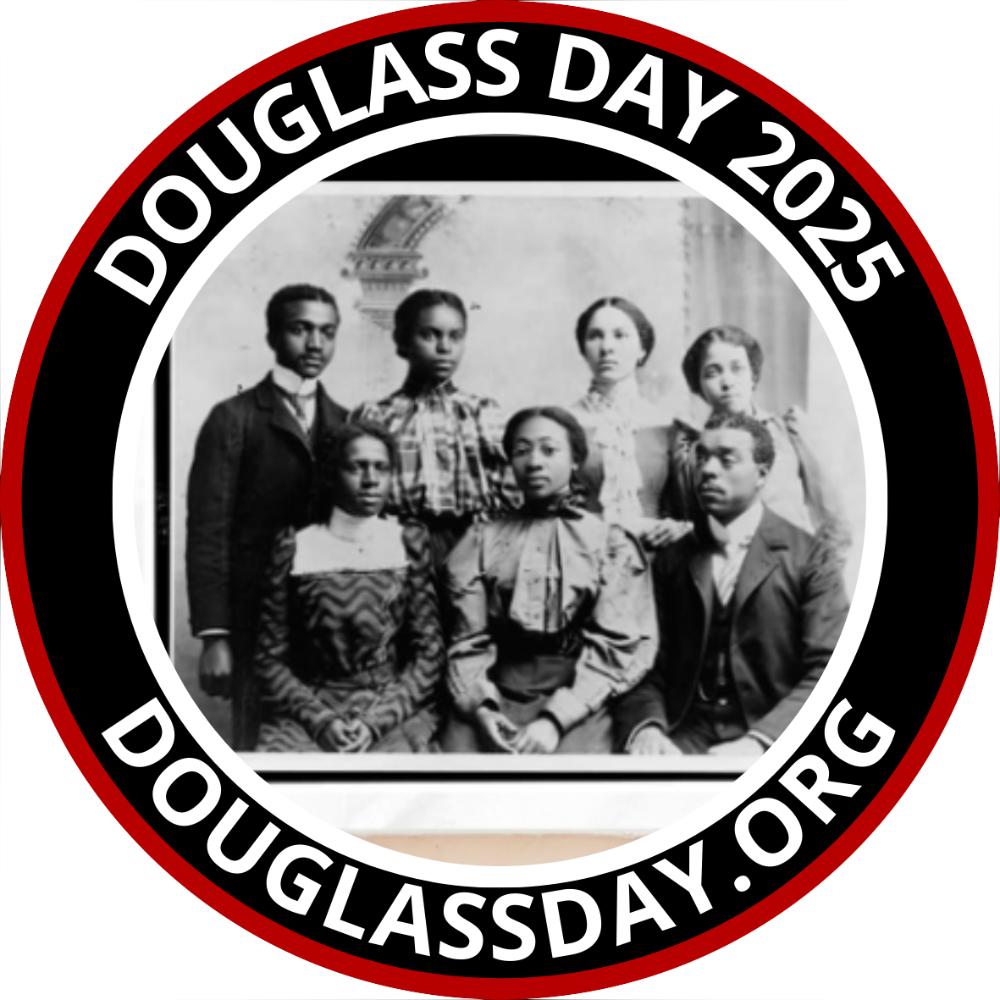

{: .alt-warning}
Download a [handy transcription crib sheet]({{ site.url }}/assets/transcribe-douglass-2024-instructions.pdf) from the Library of Congress.

# How Do I Transcribe?

Every Douglass Day, participants, wherever they are, work together to transcribe historical documents that help tell the story of Black activism in the United States. The 2025 transcribe-a-thon focuses on the [African American Perspectives Collection at the Library of Congress](https://www.loc.gov/collections/african-american-perspectives-rare-books/about-this-collection/).

Transcribers will use the Library of Congress' [By the People](https://crowd.loc.gov/) platform to do the work.

## Account registration

You can transcribe *without registering an account on the By the People website*. But creating an account will enable you to track your transcriptions and participate as a reviewer as well as a transcriber. From your profile page, you can download a letter from the Library of Congress documenting all your contributions to the project. We enthusiastically recommend registering!

## Overview

The most important thing to keep in mind about this transcription project is that *every contribution from every transcriber helps move the project forward!* Crowdsourced transcription is a genuinely collective effort that you can participate in without being an expert in history, archival documents, or handwriting. All transcriptions go through a review process before being used, so you don't have to worry if you can transcribe only part of a document, aren't certain about some of the words you've transcribed, or make mistakes. *Just do your best.* Others will review your work and complete it or make corrections as needed.

When you bring up a new document, take a few minutes to look it over before diving into transcription. Who seems to be the intended recipient of the document? What does the document seem to be about? Asking yourself these questions will help you situate the document in a human context. Next, scan the document for words you *can* read, rather than dwelling and getting stuck on the ones you can't make out. Words that at first appear unreadable may suddenly come into focus for you as you begin to understand the words *around* them.

All that said, if you're completely flummoxed by a document, click to bring up a new one. No shame in that! Keep clicking till you find one that you think you can transcribe at least partially.

## Detailed instructions

The By the People website has [detailed instructions](https://crowd.loc.gov/get-started/how-to-transcribe/) to guide you in transcribing documents in a way that meets their goals. In addition, you might find it helpful to download this [handy transcription crib sheet]({{ site.url }}/assets/transcribe-douglass-2024-instructions.pdf) from the Library of Congress.

The site explains [how to review transcribed documents](https://crowd.loc.gov/get-started/how-to-review/). You *do* need to register an account in order to review transcribed documents.

## Limbering up

You don't need to wait for Douglass Day to start developing your transcribing skills. We recommend that you do the following to get yourself ready for Douglass Day.

- Register an account with [By the People](https://crowd.loc.gov/) (optional but recommended)
- Vist the campaign for the [correspondence of James A. Garfield](https://crowd.loc.gov/campaigns/garfield-correspondence/). You can visit any campaign, really, but the advantage of visiting the Garfield campaign is twofold: (1) Like the Douglass letters, the Garfield letters are written in a nineteenth-century hand; and (2) There are lots of letters still to be transcribed.
- Look at some of the completed transcriptions to get a feel for how your own transcriptions should look.
- Start transcribing! Notice that you can pull up a window with quick tips about transcription protocols right in the transcription interface. Strive for accuracy but remember that your transcription needn't be perfect or complete. *Every contribution moves the project forward.* If you find a page too difficult, you can simply pull up another. If you find transcription itself too difficult, you can contribute by reviewing or tagging others' transcriptions. There are multiple ways to contribute!
- Take a moment to notice and be inspired by the number of people who've contributed to this and other By the People campaigns. This is the power of community!

