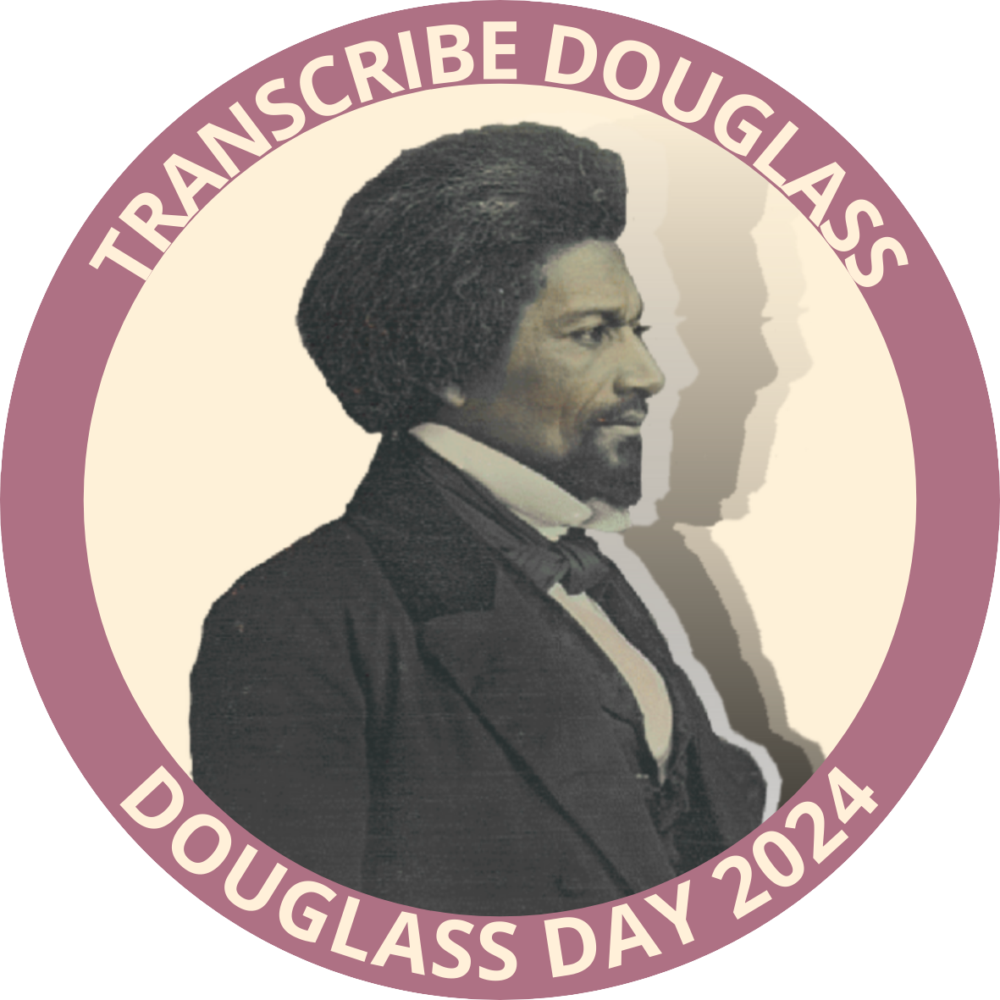

# How Do I Transcribe?

Every Douglass Day, participants, wherever they are, work together to transcribe historical documents that help tell the story of Black activism in the United States. The 2024 transcribe-a-thon focuses on the [correspondence of Frederick Douglass in the Library of Congress](https://www.loc.gov/search/?fa=partof:frederick+douglass+papers:+general+correspondence,+1841-1912).

Transcribers will use the Library of Congress' [By the People](https://crowd.loc.gov/) platform to do the work.

## Account registration

You can transcribe *without registering an account on the By the People website*. But creating an account will enable you to track your transcriptions and participate as a reviewer as well as a transcriber. From your profile page, you can download a letter from the Library of Congress documenting all your contributions to the project. We enthusiastically recommend registering!

## Overview

Different transcription projects have different aims. The Library of Congress' By the People project is aimed primarily at improving the searchability, readability, and accessibility of documents in their collection for people who use screen readers or other assistive technology.

The project also seeks to honor the document creators' historical reality by preserving the original spelling, grammar, and punctuation in their documents.

## Detailed instructions

The By the People website has [detailed instructions](https://crowd.loc.gov/get-started/how-to-transcribe/) to guide you in transcribing documents in a way that meets their goals.

The site also explains [how to review transcribed documents](https://crowd.loc.gov/get-started/how-to-review/). You do need to register an account in order to review transcribed documents.

## Limbering up

You don't need to wait for Douglass Day to start developing your transcribing skills. We recommend that you do the following to get yourself ready for Douglass Day.

- Register an account with [By the People](https://crowd.loc.gov/) (optional but recommended)
- Vist the campaign for the [correspondence of James A. Garfield](https://crowd.loc.gov/campaigns/garfield-correspondence/). You can visit any campaign, really, but the advantage of visiting the Garfield campaign is twofold: (1) Like the Douglass letters, the Garfield letters are written in a nineteenth-century hand; and (2) There are lots of letters still to be transcribed.
- Look at some of the completed transcriptions to get a feel for how your own transcriptions should look.
- Start transcribing! Notice that you can pull up a window with quick tips about transcription protocols right in the transcription interface. Strive for accuracy but remember that your transcription needn't be perfect or complete. *Every contribution moves the project forward.* If you find a page too difficult, you can simply pull up another. If you find transcription itself too difficult, you can contribute by reviewing or tagging others' transcriptions. There are multiple ways to contribute!
- Take a moment to notice and be inspired by the number of people who've contributed to this and other By the People campaigns. This is the power of community!

