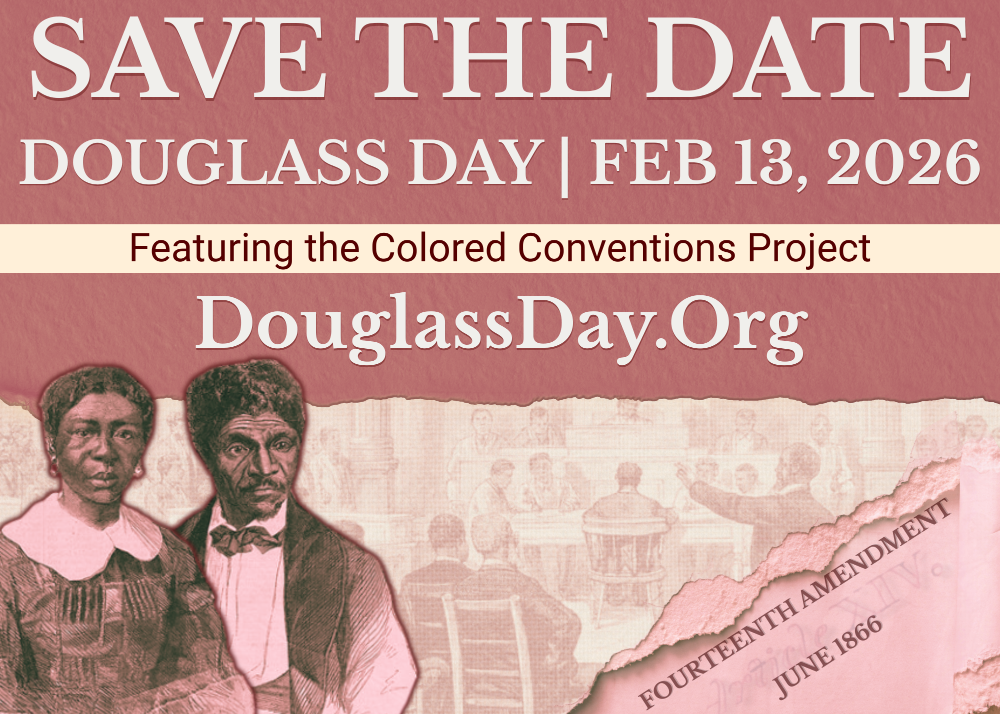
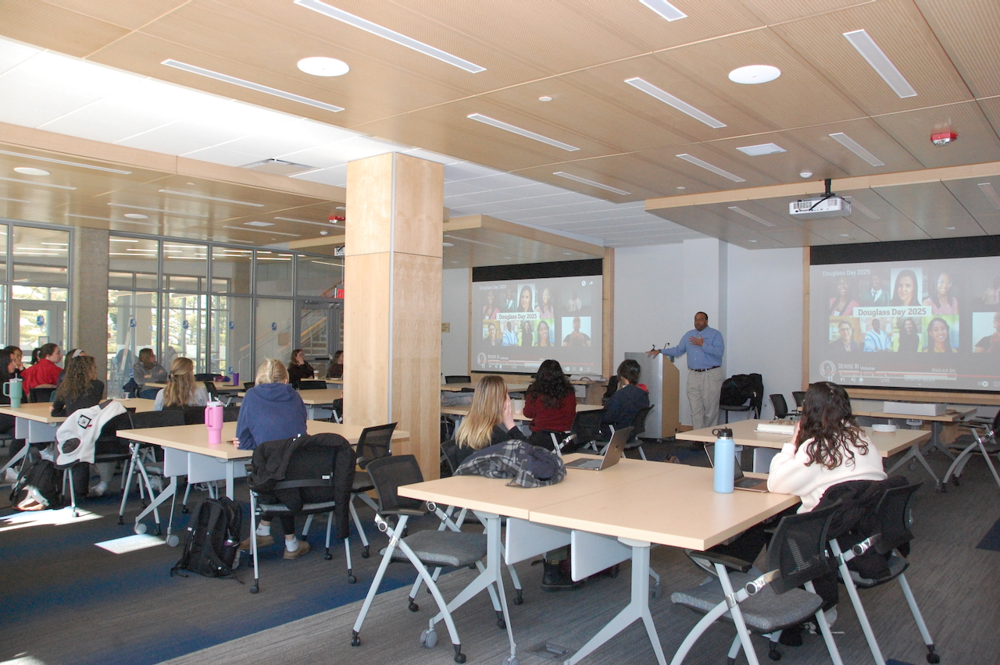
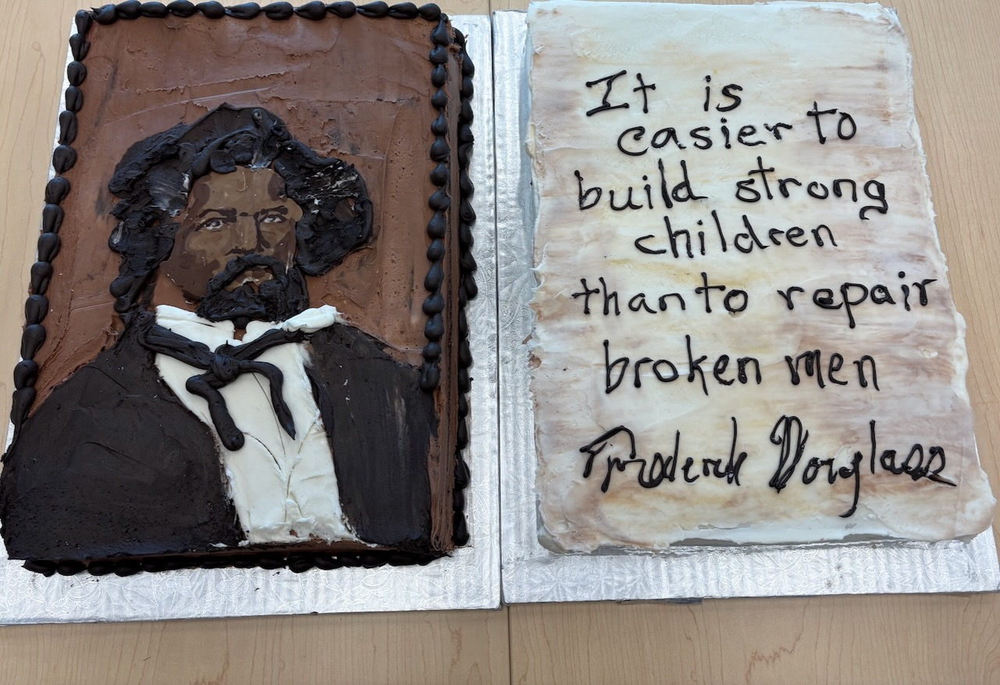

# Douglass Day 2026 at Geneseo

<!-- {: .alt-warning}
Go straight to the [schedule]({{ site.url }}/schedule) or to [our easy-to-follow instructions]({{ site.url }}/how-to-transcribe) for transcribing documents. -->

[Douglass Day](https://douglassday.org) at SUNY Geneseo returns on **February 13, 2026**&mdash;in the gorgeous [Multi-Purpose Rooms (134/129)](https://d2jv02qf7xgjwx.cloudfront.net/customers/101/images/multipurpose-room.png) of [Milne Library](https://library.geneseo.edu/)!

As in past years, the world-wide transcribe-a-thon and live stream from the organizers at [DouglassDay.org](https://douglassday.org) will take place **from 12 noon to 3 p.m.** This year's transcribe-a-thon will feature documents related to the [Colored Conventions Project](https://coloredconventions.org/), "an interdisciplinary research hub that uses digital tools to bring the buried history of nineteenth-century Black organizing to life." Geneseo participants will transcribe digitized historical documents from the nineteenth-century state and local political meetings, known at the time as "Colored Conventions," where African Americans from the United States and Canada gathered to organize their struggle for civil and human rights.

As they've done the past two years, the Geneseo Chamber Singers will perform in Milne Library in the late morning, before the live stream begins. We're working to organize other morning activities as well. Watch this page for more details as our plans take shape!

## What exactly is Douglass Day?

Described by its national [organizers](https://douglassday.org/about/) as a day of "collective action for Black history," every year Douglass Day gives participants the opportunity to [create communal spaces for remembering and preserving Black history with Black communities](https://douglassday.org/about/principles/) in ways that promote critical reflection and joy.

Each year, the Douglass Day organizers invite people everywhere to help transcribe digitized collections important to Black history. Previous transcribe-a-thons have focused on the papers of Anna Julia Cooper, Mary Church Terrell, Mary Ann Shadd Cary, and Frederick Douglass himself, along with documents from the [African American Perspectives Collection at the Library of Congress](https://www.loc.gov/collections/african-american-perspectives-rare-books/about-this-collection/).

## Transcription? That sounds hard!

Really, though, it's not! No special skills required. We'll provide clear, detailed instructions at the transcribe-a-thon. Academic faculty, professional faculty, and students will be on hand to answer any questions you may have. All you need is a laptop and your enthusiasm!

## Look how much fun we had last year!

The Geneseo Chamber Singers, under the direction of Distinguished Service Professor of Music Gerarld Floriano, performed three choral pieces: "The Last Words of David" (composer [Randall Thompson](https://en.wikipedia.org/wiki/Randall_Thompson)); "Daniel, Daniel Servant of the Lord" (traditional, arranged by [Undine Smith Moore](https://en.wikipedia.org/wiki/Undine_Smith_Moore)); and "My Soul's Been Anchored in the Lord" (traditional, arranged by [Moses Hogan](https://en.wikipedia.org/wiki/Moses_Hogan)). 

<iframe width="560" height="315" src="https://www.youtube.com/embed/kr1pQpw4jT8?si=xTRNAHCSykpNOcFQ" title="YouTube video player" frameborder="0" allow="accelerometer; autoplay; clipboard-write; encrypted-media; gyroscope; picture-in-picture; web-share" referrerpolicy="strict-origin-when-cross-origin" allowfullscreen style="margin-bottom: 5px;"></iframe>

<iframe width="560" height="315" src="https://www.youtube.com/embed/p3wYKer3bHg?si=ZFIFDdcnZrYjITj4" title="YouTube video player" frameborder="0" allow="accelerometer; autoplay; clipboard-write; encrypted-media; gyroscope; picture-in-picture; web-share" referrerpolicy="strict-origin-when-cross-origin" allowfullscreen style="margin-bottom: 5px;"></iframe>

<iframe width="560" height="315" src="https://www.youtube.com/embed/Rgurt8PUCy8?si=7LhV2XYa1CpVXlzr" title="YouTube video player" frameborder="0" allow="accelerometer; autoplay; clipboard-write; encrypted-media; gyroscope; picture-in-picture; web-share" referrerpolicy="strict-origin-when-cross-origin" allowfullscreen style="margin-bottom: 5px;"></iframe>

Geneseo Chief Diversity Officer Rodmon King teed up the transcribe-a-thon with some words about the relevance of Frederick Douglass and his legacy to the present day.

We enjoyed these gorgeous and delicious cakes donated by [Sweet Arts Bakery](https://sweetartsny.weebly.com/), Main Street, Geneseo.

