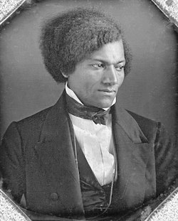
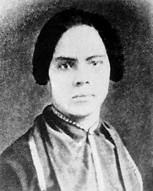

Welcome to the home of Douglass Day at SUNY Geneseo. Watch this space for information about how Geneseo will participate in Douglass Day on February 14&mdash;the date on which [Frederick Douglass](https://www.nps.gov/people/frederick-douglass.htm) chose to celebrate his birthday&mdash;from 12 p.m. to 3 p.m. 

Described by its [organizers](https://douglassday.org/about/) as a day of "collective action for Black history," Douglass Day gives participants the opportunity to [create communal spaces for remembering and preserving Black history with Black communities](https://douglassday.org/about/principles/) in ways that promote critical reflection and joy.

Each year, the Douglass Day organizers invite people everywhere to help transcribe digitized collections important to Black history. This year, participants will help transcribe the papers of activist, abolitionist, women's rights advocate, writer, teacher, and lawyer [Mary Ann Shadd Cary](https://www.nps.gov/people/mary-ann-shadd-cary.htm) (1823-1893), [the first Black woman in North America to edit a weekly newspaper](https://www.womenofthehall.org/inductee/mary-ann-shadd-cary/). (The Douglass Day website has a [wealth of additional information about Shadd Cary's life and importance](https://douglassday.org/shadd/).)

Never transcribed historical documents before? No worries&mdash;it's easy, and we'll show you how! Hope you'll join us this Valentine's Day for a joyous celebration of Black history, activism, and digital preservation! 

 

*Photo credits: [Frederick Douglass](https://commons.wikimedia.org/wiki/File:Frederick_Douglass_(1840s).jpg), [Mary Ann Shadd Cary](https://commons.wikimedia.org/wiki/File:Mary_Ann_Shadd.jpg), Public domain, via Wikimedia Commons.* 