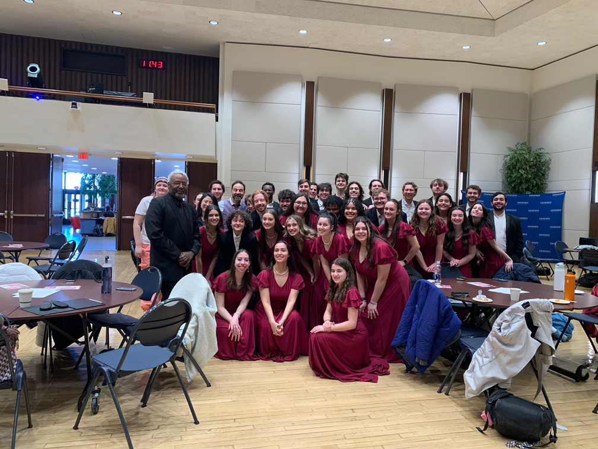
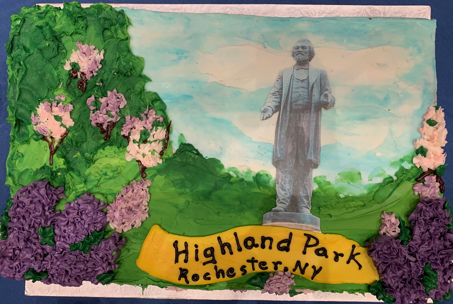

# Douglass Day 2025 at Geneseo

{: .alt-warning}
Go straight to the [schedule]({{ site.url }}/schedule) or to [our easy-to-follow instructions]({{ site.url }}/how-to-transcribe) for transcribing documents.

[Douglass Day](https://douglassday.org) at SUNY Geneseo returns on **February 14, 2025**&mdash;in the gorgeous [Multi-Purpose Rooms (134/129)](https://d2jv02qf7xgjwx.cloudfront.net/customers/101/images/multipurpose-room.png) of newly renovated [Milne Library](https://library.geneseo.edu/)!

Our celebration begins at **11:15 a.m.** in Milne with the Geneseo Chamber Singers, under the direction of Distinguished Service Professor Gerry Floriano, performing choral music celebrating Frederick Douglass's life, vision, and legacy.

At **11:30 a.m.**, Geneseo Chief Diversity Officer Rodmon King will offer opening remarks.

As in past years, the world-wide transcribe-a-thon and live stream from the organizers at [DouglassDay.org](https://douglassday.org) will take place **from 12 noon to 3 p.m.** This year's transcribe-a-thon will feature the [African American Perspectives Collection at the Library of Congress](https://www.loc.gov/collections/african-american-perspectives-rare-books/about-this-collection/).

We'll have delicious birthday cake courtesy of [Sweet Arts Bakery](https://sweetartsny.weebly.com/) on Main St., Geneseo.

Described by its national [organizers](https://douglassday.org/about/) as a day of "collective action for Black history," every year Douglass Day gives participants the opportunity to [create communal spaces for remembering and preserving Black history with Black communities](https://douglassday.org/about/principles/) in ways that promote critical reflection and joy.

Each year, the Douglass Day organizers invite people everywhere to help transcribe digitized collections important to Black history. Previous "transcribe-a-thons" have focused on records from the [Colored Conventions project](https://coloredconventions.org/) papers of Anna Julia Cooper, Mary Church Terrell, and Mary Ann Shadd Cary, and correspondence of Frederick Douglass himself.

## Transcription? That sounds hard!

Really, though, it's not! We'll use the Library of Congress' [By the People](https://crowd.loc.gov/) platform to do our transcribing, and the LOC has provided [clear, detailed instructions](https://crowd.loc.gov/get-started/how-to-transcribe/) for how to do the work. You have the option to create a By the People account to track your transcriptions and help review other people's transcriptions, but creating an account is optional. You don't need an account to pitch in and help transcribe.

Academic faculty, professional faculty, and students will be on hand to answer any questions you may have.

## Look how much fun we had last year!

<iframe width="560" height="315" src="https://www.youtube.com/embed/iQutmhLKZH8?si=I5tZdnxDl3SGdPvn" title="YouTube video player" frameborder="0" allow="accelerometer; autoplay; clipboard-write; encrypted-media; gyroscope; picture-in-picture; web-share" referrerpolicy="strict-origin-when-cross-origin" allowfullscreen></iframe>  
*The Geneseo Chamber Singers perform "Eyes on the Prize," conducted by Distinguished Service Professor of Music Gerry Floriano.*

  
*Group portrait of the Geneseo Chamber Singers with Maestro Floriano and Wade Anthony Norwood, of the Rochester gospel group Wayne Anthony Norwood and the Children of God.*

  
*Students transcribe documents from the Library of Congress collection of Douglass correspondence during the live stream.*

  
*Douglass Day Cake and cupcakes generously donated by [Sweet Arts Bakery](https://sweetartsny.weebly.com/), Main Street, Geneseo.*

  
*The Sweet Arts cake is decorated with the Frederick Douglass statue in Highland Park, Rochester.*

  
*Professor of History Justin Behrend cuts the cake.*

  
*Douglass Day cake generously donated by Campus Auxiliary Services at Geneseo. One of two.*

  
*The second cake from Campus Auxiliary Services.*