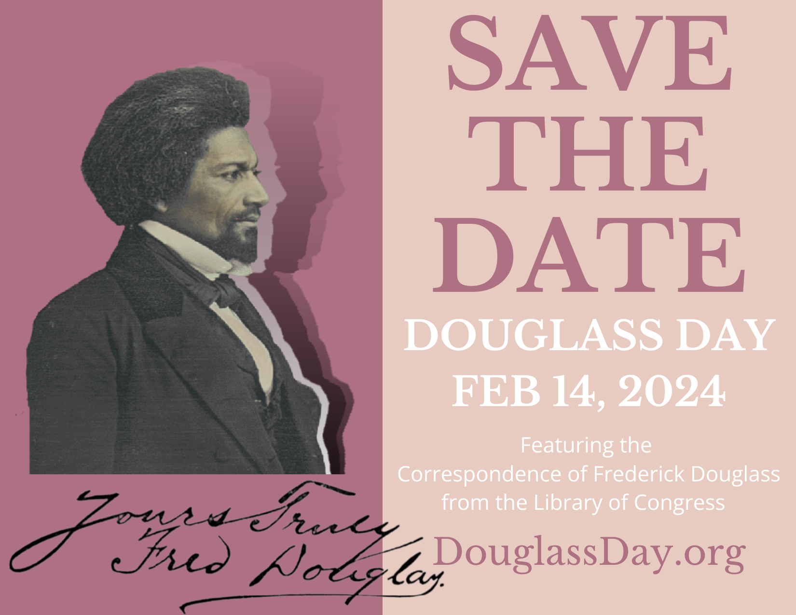

# Douglass Day 2024 at Geneseo

[Douglass Day](https://douglassday.org) at SUNY Geneseo returns on **February 14, 2024**, sponsored by the Geneseo [Center for Digital Learning](https://geneseo.edu/cdl).

Described by its national [organizers](https://douglassday.org/about/) as a day of "collective action for Black history," every year Douglass Day gives participants the opportunity to [create communal spaces for remembering and preserving Black history with Black communities](https://douglassday.org/about/principles/) in ways that promote critical reflection and joy.

Each year, the Douglass Day organizers invite people everywhere to help transcribe digitized collections important to Black history. Previous "transcribe-a-thons" have focused on records from the [Colored Conventions project](https://coloredconventions.org/) and papers of Anna Julia Cooper, Mary Church Terrell, and Mary Ann Shadd Cary.

This year's transcribe-a-thon will feature [correspondence of Frederick Douglass himself](https://www.loc.gov/search/?fa=partof:frederick+douglass+papers:+general+correspondence,+1841-1912) in the archives of the Library of Congress.

## Transcription? That sounds hard!

Really, though, it's not! We'll have detailed instructions for transcribing the Douglass papers right here, including how-to videos, when they become available from the national organizers. And there'll be academic faculty, professional faculty, and students on hand to help.

## Let's make this a Geneseo tradition!

Last Douglass Day (February 14, 2023), about 40-50 students, faculty (academic and professional), and administrators gathered to celebrate Black history and activism along with some 7,000 participants from across the U.S., Europe, and Africa. Together, we helped transcribe the papers of activist, abolitionist, women's rights advocate, writer, teacher, and lawyer [Mary Ann Shadd Cary](https://www.zooniverse.org/projects/douglassday/transcribe-shadd-cary) (1823-1893), [the first Black woman in North America to edit a weekly newspaper](https://www.womenofthehall.org/inductee/mary-ann-shadd-cary/). During intermissions, the Douglass Day [playlist on Spotify](https://open.spotify.com/playlist/2XWu7KUki8NL5ps1FT7PC7?si=1234136005f24f7a&nd=1) served as background to our transcription work.

Learn more about our 2023 efforts by browsing through the resources on [these archived pages]({{ site.url}}/2023/overview).

  
*Geneseo campus community members transcribing papers of Mary Ann Shadd Cary on Douglass Day 2023*