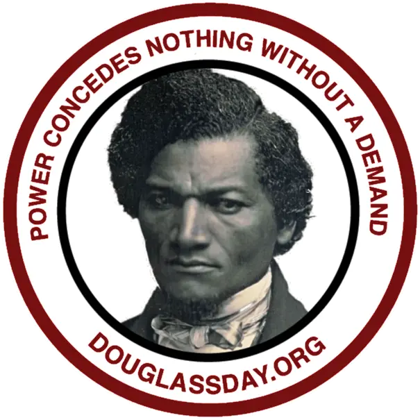

Here are some resources to help you fold Douglass Day into a course you're teaching this spring.

## Syllabus description

If you're looking for some language you can include on your syllabus, in an assignment prompt, or in a communication to your students, feel free to adapt this one to your purposes:

> Described by its national organizers as a day of "collective action for Black history," Douglass Day gives participants the opportunity to create communal spaces for remembering and preserving Black history with Black communities in ways that promote critical reflection and joy. Each year on February 14&mdash;the date on which Frederick Douglass chose to celebrate his birthday&mdash;the Douglass Day organizers invite people everywhere to help transcribe digitized collections important to Black history. This year, participants will help transcribe the papers of activist, abolitionist, women’s rights advocate, writer, teacher, and attorney Mary Ann Shadd Cary (1823-1893), the first Black woman in North America to edit a weekly newspaper. SUNY Geneseo will participate in Douglass Day from 12 p.m. to 3 p.m. in the College Union Hunt Room, watching the live stream from the organizers and transcribing documents. (Transcription instructions and support will be provided.) All you need to bring is your laptop and your enthusiasm. **RSVP not required but appreciated:** [https://forms.gle/71d9Uax4yKPBkjHh7](https://forms.gle/71d9Uax4yKPBkjHh7)

## Transcription guide

The Douglass Day main website has a handy [transcription guide](https://douglassday.org/how-to-transcribe/) that you can consult online or download and print. The explainer currently on the site is for Douglass Day 2022, but it's broadly applicable to the transcription process generally. When the explainer for this year's Douglass Day goes up on the site, we'll make sure that the link here is current as well.

## Ways you and your class can participate in Douglass Day

### Join your students for the live stream and/or transcribe-a-thon, or send them on their own

- Have students create accounts on [Zooniverse](https://zooniverse.org), do some **transcribing**, and then send you links to their saved and submitted transcriptions as a **required or extra-credit assignment**. (Have those students who'd prefer not to create an account take screenshots of their transcription work or photograph it with their phones.)
- In addition to, or instead of, asking students to transcribe, ask them to **write a short reflection** on one or more of the following:
    - How the activity of transcribing an original historical document (if they engaged in it) changed their connection to or understanding of history in general or Black history, women's history, or intersectional history in particular
    - How participating in Douglass Day (whether or not they transcribed) changed their understanding of some idea/issue/time period/text you're studying with them in class
    - How participating in Douglass Day (whether or not they transcribed) revealed or reinforced some personal meaning that they find in Black history, women's history, intersectional history, or activism

We'd love to post **thoughtful, well-crafted student writing**&mdash;on these or other topics directly connected to Douglass Day&mdash;right here on the website. You can either [share for consideration](https://drive.google.com/drive/folders/1iq2IstmrIpenJFcDPwvCVqx1b8LXWhSw?usp=sharing) writing that you (or your class as a whole) have selected, or encourage interested students to contact us directly about including their work. Please be sure to read our [guidelines](https://docs.google.com/document/d/1UapGPRFi1bw2dW6lWwpOsZz0fMrB2cg5T9Stlu9b8os/edit?usp=sharing) (Geneseo account required) for student writing to be included on the site. (As the guidelines point out, graphics meant to accompany any written content should be submitted separately to [this folder](https://drive.google.com/drive/folders/1eaoRWFKb6DwSHky_1NkZkBXsF1V9Zyob?usp=sharing).)

### Contribute your own content to the Geneseo Douglass Day site

We'd love to post **scholarly content and personal reflections** from Geneseo academic and professional faculty here. We're interested in short, **thoughtful, well-crafted pieces connected directly to the themes of Douglass Day 2023**. We have [guidelines](https://docs.google.com/document/d/16nBhZU5Lz3ZURyFXPpevbyQUpNj_XdJrfGHaPVoOGUg/edit?usp=sharing) for faculty content as well.

We also welcome suggestions for **links and references** to be added to our [Reading](reading) page. We've created a [folder in Google Drive](https://drive.google.com/drive/folders/1uvN0x0ZZYeXAJxf-1bdYEuhNPAzC9YkY?usp=sharing) that's visible to Geneseo account holders only where you can share pdfs. You can share links to websites in [this spreadsheet](https://docs.google.com/spreadsheets/d/1x3rNPCyg6fbS26sYWQ_Bue86lY33afHlmbWPw5NpTBI/edit?usp=sharing).

## Finding Douglass Day resources in Geneseo's Google Drive

Here's a link to the [enclosing folder](https://drive.google.com/drive/folders/1SaoC64Kh4Jrtb5Q7rU0Pg_-DJrPyTws8?usp=sharing) for all the other folders and documents mentioned above. Be sure to look at the README for the folder before adding content. (Thanks!)

## Douglass Day graphics for handouts, posters, etc.

The national Douglass Day organizers [have you covered](https://douglassday.org/kit-2023/flyers-graphics-2023/).