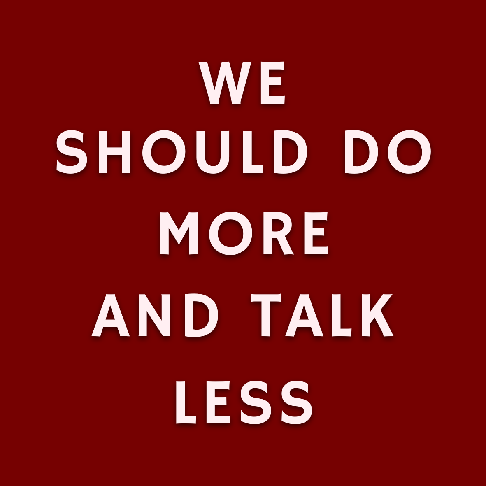

- Paul Schacht, Professor of English and Director, Center for Digital Learning
- Melanie Medeiros, Associate Professor of Anthropology and Director, Center for Integrative Learning
- Justin Behrend, Professor and Chair, Department of History
- Alexis Clifton, Interim Director, Teaching and Learning Center
- Sarah Frank, Director of Residence Life
- Abby Henry, Center for Digital Learning Student Affiliate
- Jacob Zaengle, Center for Digital Learning Student Affiliate