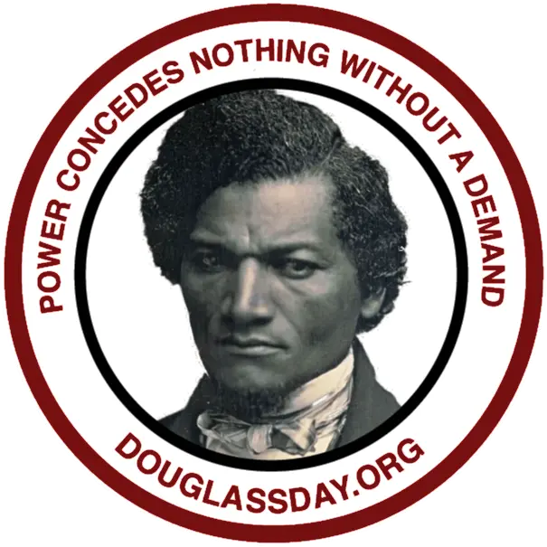

# Schedule for Douglass Day 2024

We have a full day of activities lined up for Douglass Day 2024, with a presentation and musical performances in the morning and a transcribe-a-thon in the afternoon. 

Organizers will be on hand to help with transcription, but remember that there are many ways to contribute&mdash;from transcribing handwritten or printed documents to simply identifying names in the documents&mdash;and that you don't have to overthink accuracy: it's fine just to do the best job you can.

If you're not able to join us in the Ballroom, you can watch the live stream and participate in transcription on your own device, wherever you are.

## Morning

### 9:30 | The Archive of Black History and Culture at Rochester Public Library

- Antoine McDonald, librarian in the Local History and Genealogy division of the Rochester Public Library, will give a presentation on ...

### 10:30 | Musical performances 

- Wayne Anthony Norwood and the Children of God
- Geneseo Chamber Singers

## Afternoon

### 12:00 - 12:30 | Live Broadcast

We'll join the organizers in singing <a href="https://douglassday.org/anthem/" rel="nofollow ugc noopener">“Lift Every Voice and Sing”</a>, receive an overview of the program, and listen to speakers on Douglass.

### 12:30 - 1:00 | Transcription and more

Time for transcribing, readings, discussions, etc. During this time, the live stream will continue running but will go silent. The organizers' <a href="https://open.spotify.com/playlist/2XWu7KUki8NL5ps1FT7PC7?si=1234136005f24f7a" rel="nofollow ugc noopener">Spotify playlist</a> will back us up as we transcribe.

### 1:00 - 1:30 | Live Broadcast

We'll sing “Happy birthday” (both versions) and hear a dramatic reading of “Why Hold a Colored Convention?” by Hassan El-Amin.

### 1:30 - 2:00 | Transcription

### 2:00 - 2:20 | Live Broadcast

### 2:20 - 2:45 | Transcription

### 2:45 - 3:00 | Live Broadcast

Highlights from social media, Bake Off prizes, and closing reflections.

<!-- 

 -->